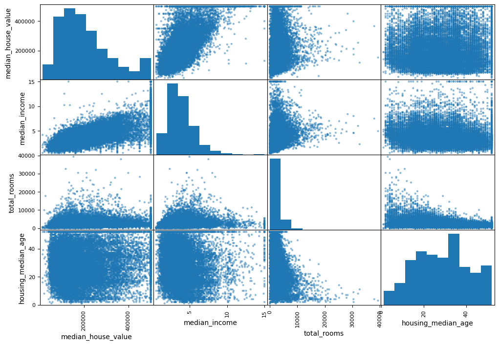
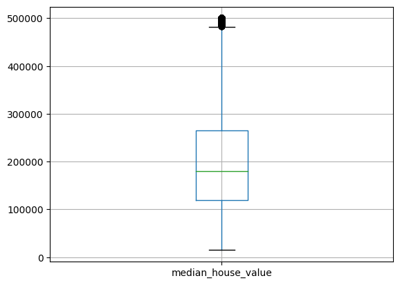
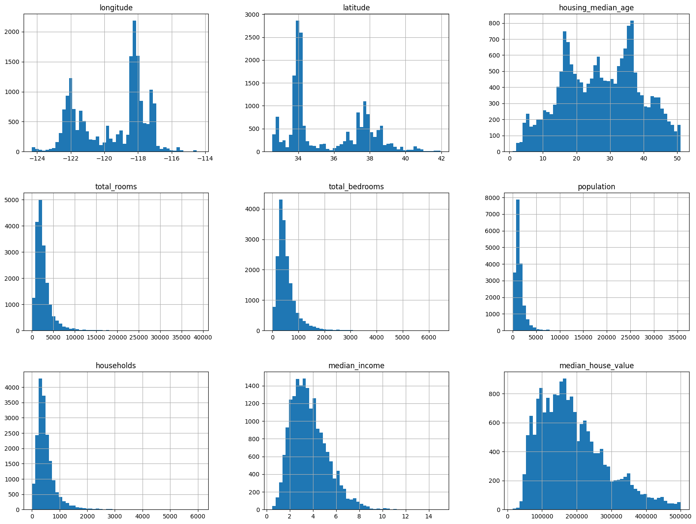
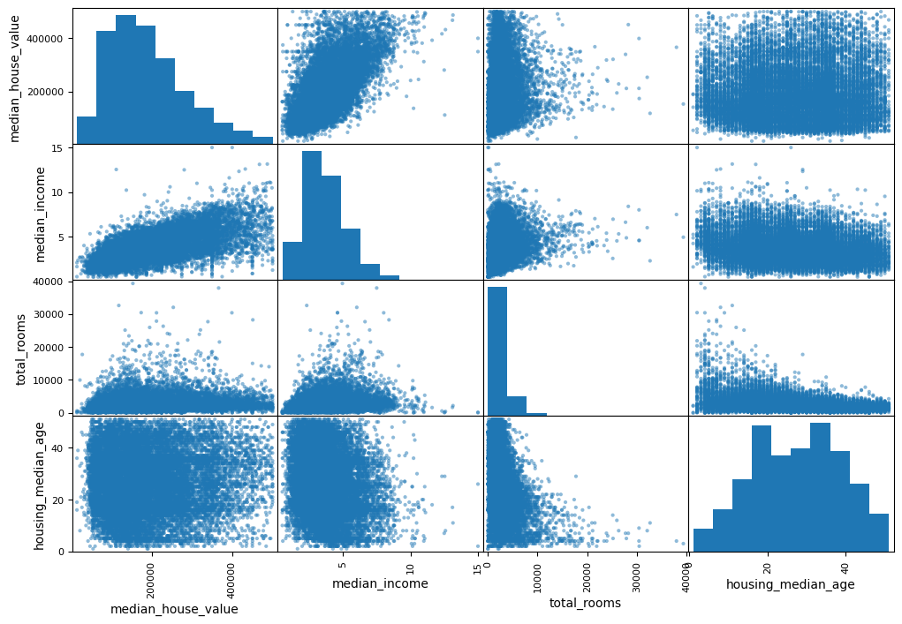

```python
import numpy as np
import pandas as pd
import sklearn as sk

#Check list
# 1) Frame the problem, look at th ebig picture
# 2) Get data
# 3) Explore data, gain insights
# 4) Prepare data to expose underlying patters for ml models
# 5) Explore models, shortlist best ones
# 6) Fine tune models and combine them
# 7) Launch, monitor and maintain
```


```python
from pathlib import Path
import tarfile
import urllib.request

def load_housing_data():
    tarball_path = Path("datasets/housing.tgz")
    if not tarball_path.is_file():
        Path("datasets").mkdir(parents=True, exist_ok=True)
        url = "https://github.com/ageron/data/raw/main/housing.tgz"
        urllib.request.urlretrieve(url, tarball_path)
        with tarfile.open(tarball_path) as housing_tarball:
            housing_tarball.extractall(path="datasets")
    return pd.read_csv(Path("datasets/housing/housing.csv"))

housing = load_housing_data()
```


```python
# Data exploration

# Number of columns and rows,
# We can see 'total_bedrooms' is missing some values
housing.info()
```

    <class 'pandas.core.frame.DataFrame'>
    RangeIndex: 20640 entries, 0 to 20639
    Data columns (total 10 columns):
     #   Column              Non-Null Count  Dtype  
    ---  ------              --------------  -----  
     0   longitude           20640 non-null  float64
     1   latitude            20640 non-null  float64
     2   housing_median_age  20640 non-null  float64
     3   total_rooms         20640 non-null  float64
     4   total_bedrooms      20433 non-null  float64
     5   population          20640 non-null  float64
     6   households          20640 non-null  float64
     7   median_income       20640 non-null  float64
     8   median_house_value  20640 non-null  float64
     9   ocean_proximity     20640 non-null  object 
    dtypes: float64(9), object(1)
    memory usage: 1.6+ MB


```python
# A concise summary of the dataset
housing.head()
```


<div>
<style scoped>
    .dataframe tbody tr th:only-of-type {
        vertical-align: middle;
    }

    .dataframe tbody tr th {
        vertical-align: top;
    }

    .dataframe thead th {
        text-align: right;
    }
</style>
<table border="1" class="dataframe">
  <thead>
    <tr style="text-align: right;">
      <th></th>
      <th>longitude</th>
      <th>latitude</th>
      <th>housing_median_age</th>
      <th>total_rooms</th>
      <th>total_bedrooms</th>
      <th>population</th>
      <th>households</th>
      <th>median_income</th>
      <th>median_house_value</th>
      <th>ocean_proximity</th>
    </tr>
  </thead>
  <tbody>
    <tr>
      <th>0</th>
      <td>-122.23</td>
      <td>37.88</td>
      <td>41.0</td>
      <td>880.0</td>
      <td>129.0</td>
      <td>322.0</td>
      <td>126.0</td>
      <td>8.3252</td>
      <td>452600.0</td>
      <td>NEAR BAY</td>
    </tr>
    <tr>
      <th>1</th>
      <td>-122.22</td>
      <td>37.86</td>
      <td>21.0</td>
      <td>7099.0</td>
      <td>1106.0</td>
      <td>2401.0</td>
      <td>1138.0</td>
      <td>8.3014</td>
      <td>358500.0</td>
      <td>NEAR BAY</td>
    </tr>
    <tr>
      <th>2</th>
      <td>-122.24</td>
      <td>37.85</td>
      <td>52.0</td>
      <td>1467.0</td>
      <td>190.0</td>
      <td>496.0</td>
      <td>177.0</td>
      <td>7.2574</td>
      <td>352100.0</td>
      <td>NEAR BAY</td>
    </tr>
    <tr>
      <th>3</th>
      <td>-122.25</td>
      <td>37.85</td>
      <td>52.0</td>
      <td>1274.0</td>
      <td>235.0</td>
      <td>558.0</td>
      <td>219.0</td>
      <td>5.6431</td>
      <td>341300.0</td>
      <td>NEAR BAY</td>
    </tr>
    <tr>
      <th>4</th>
      <td>-122.25</td>
      <td>37.85</td>
      <td>52.0</td>
      <td>1627.0</td>
      <td>280.0</td>
      <td>565.0</td>
      <td>259.0</td>
      <td>3.8462</td>
      <td>342200.0</td>
      <td>NEAR BAY</td>
    </tr>
  </tbody>
</table>
</div>


```python
# The type of categorical data - we have identified 'ocean_proximity'

housing["ocean_proximity"].value_counts()
```


    ocean_proximity
    <1H OCEAN     9136
    INLAND        6551
    NEAR OCEAN    2658
    NEAR BAY      2290
    ISLAND           5
    Name: count, dtype: int64


```python
# Retrieving the columns where the total_bedrooms is null
# 207 entries with missing total_bedrooms value

null_bedrooms = housing[housing["total_bedrooms"].isna()]
null_bedrooms.info()
```

    <class 'pandas.core.frame.DataFrame'>
    Index: 207 entries, 182 to 20345
    Data columns (total 10 columns):
     #   Column              Non-Null Count  Dtype  
    ---  ------              --------------  -----  
     0   longitude           207 non-null    float64
     1   latitude            207 non-null    float64
     2   housing_median_age  207 non-null    float64
     3   total_rooms         207 non-null    float64
     4   total_bedrooms      0 non-null      float64
     5   population          207 non-null    float64
     6   households          207 non-null    float64
     7   median_income       207 non-null    float64
     8   median_house_value  207 non-null    float64
     9   ocean_proximity     207 non-null    object 
    dtypes: float64(9), object(1)
    memory usage: 17.8+ KB


```python
# Generate deccriptive statistics of the dataset

# From a general plotting of each feature we can see that some are tail/head heavy
# We can improve this with a mean avg distribution for better model training
%matplotlib inline

import matplotlib as plt 
housing.hist(bins=50, figsize=(20, 15))
```


    array([[<Axes: title={'center': 'longitude'}>,
            <Axes: title={'center': 'latitude'}>,
            <Axes: title={'center': 'housing_median_age'}>],
           [<Axes: title={'center': 'total_rooms'}>,
            <Axes: title={'center': 'total_bedrooms'}>,
            <Axes: title={'center': 'population'}>],
           [<Axes: title={'center': 'households'}>,
            <Axes: title={'center': 'median_income'}>,
            <Axes: title={'center': 'median_house_value'}>]], dtype=object)


    

    


```python
# Check for correlation between attributes
# We can see some attributes are capped at a certain value
from pandas.plotting import scatter_matrix

attributes = ["median_house_value", "median_income", "total_rooms", "housing_median_age"]
scatter_matrix(housing[attributes], figsize=(12, 8))
```


    array([[<Axes: xlabel='median_house_value', ylabel='median_house_value'>,
            <Axes: xlabel='median_income', ylabel='median_house_value'>,
            <Axes: xlabel='total_rooms', ylabel='median_house_value'>,
            <Axes: xlabel='housing_median_age', ylabel='median_house_value'>],
           [<Axes: xlabel='median_house_value', ylabel='median_income'>,
            <Axes: xlabel='median_income', ylabel='median_income'>,
            <Axes: xlabel='total_rooms', ylabel='median_income'>,
            <Axes: xlabel='housing_median_age', ylabel='median_income'>],
           [<Axes: xlabel='median_house_value', ylabel='total_rooms'>,
            <Axes: xlabel='median_income', ylabel='total_rooms'>,
            <Axes: xlabel='total_rooms', ylabel='total_rooms'>,
            <Axes: xlabel='housing_median_age', ylabel='total_rooms'>],
           [<Axes: xlabel='median_house_value', ylabel='housing_median_age'>,
            <Axes: xlabel='median_income', ylabel='housing_median_age'>,
            <Axes: xlabel='total_rooms', ylabel='housing_median_age'>,
            <Axes: xlabel='housing_median_age', ylabel='housing_median_age'>]],
          dtype=object)


    

    


```python
# We can define to problem more clearly now and answer the following
# 1) Supervised, unsupervised, semi-supervised, reinforced
# 2) Classification, regression?
# 3) Batch learning or online learning

# Answers:
# 1) Supervised as we can use ground truths in the dataset
# 2) Regression as we are predicting a value quantity
# 3) Batch learning is fine as the set is small and isnt going to change rapidly

# Next, we pick a performance measure (error/loss function)
# Typical for regression is RMSE, works for our dataset - RMSE works well for sets
# with outliers

# Lets check the distribution to see how many outliers there are
# we can plot the median_house_value with their distric area (long, lat)
#housing.plot(kind="scatter", x="longitude", y="latitude", alpha=0.4,
# s=housing["population"]/100, label="population", figsize=(10,7),
# c="median_house_value", colorbar=True,
#)

housing.boxplot(column="median_house_value")
```


    <Axes: >


    

    


```python
# Cleaning the data, dealing with missing values and capped attributes

# use the corr method to compute the correlation between all pairs of variables in the housing DataFrame
# https://pandas.pydata.org/pandas-docs/stable/reference/api/pandas.DataFrame.corr.html

# We can see from the correlation matrix that filling the missing values
# with fake enterprolated data may be a bad idea as it has a low correlation 
# to the rest of the dataset
corr_matrix = housing.drop("ocean_proximity", axis=1).corr()
corr_matrix
```


<div>
<style scoped>
    .dataframe tbody tr th:only-of-type {
        vertical-align: middle;
    }

    .dataframe tbody tr th {
        vertical-align: top;
    }

    .dataframe thead th {
        text-align: right;
    }
</style>
<table border="1" class="dataframe">
  <thead>
    <tr style="text-align: right;">
      <th></th>
      <th>longitude</th>
      <th>latitude</th>
      <th>housing_median_age</th>
      <th>total_rooms</th>
      <th>total_bedrooms</th>
      <th>population</th>
      <th>households</th>
      <th>median_income</th>
      <th>median_house_value</th>
    </tr>
  </thead>
  <tbody>
    <tr>
      <th>longitude</th>
      <td>1.000000</td>
      <td>-0.924664</td>
      <td>-0.108197</td>
      <td>0.044568</td>
      <td>0.069608</td>
      <td>0.099773</td>
      <td>0.055310</td>
      <td>-0.015176</td>
      <td>-0.045967</td>
    </tr>
    <tr>
      <th>latitude</th>
      <td>-0.924664</td>
      <td>1.000000</td>
      <td>0.011173</td>
      <td>-0.036100</td>
      <td>-0.066983</td>
      <td>-0.108785</td>
      <td>-0.071035</td>
      <td>-0.079809</td>
      <td>-0.144160</td>
    </tr>
    <tr>
      <th>housing_median_age</th>
      <td>-0.108197</td>
      <td>0.011173</td>
      <td>1.000000</td>
      <td>-0.361262</td>
      <td>-0.320451</td>
      <td>-0.296244</td>
      <td>-0.302916</td>
      <td>-0.119034</td>
      <td>0.105623</td>
    </tr>
    <tr>
      <th>total_rooms</th>
      <td>0.044568</td>
      <td>-0.036100</td>
      <td>-0.361262</td>
      <td>1.000000</td>
      <td>0.930380</td>
      <td>0.857126</td>
      <td>0.918484</td>
      <td>0.198050</td>
      <td>0.134153</td>
    </tr>
    <tr>
      <th>total_bedrooms</th>
      <td>0.069608</td>
      <td>-0.066983</td>
      <td>-0.320451</td>
      <td>0.930380</td>
      <td>1.000000</td>
      <td>0.877747</td>
      <td>0.979728</td>
      <td>-0.007723</td>
      <td>0.049686</td>
    </tr>
    <tr>
      <th>population</th>
      <td>0.099773</td>
      <td>-0.108785</td>
      <td>-0.296244</td>
      <td>0.857126</td>
      <td>0.877747</td>
      <td>1.000000</td>
      <td>0.907222</td>
      <td>0.004834</td>
      <td>-0.024650</td>
    </tr>
    <tr>
      <th>households</th>
      <td>0.055310</td>
      <td>-0.071035</td>
      <td>-0.302916</td>
      <td>0.918484</td>
      <td>0.979728</td>
      <td>0.907222</td>
      <td>1.000000</td>
      <td>0.013033</td>
      <td>0.065843</td>
    </tr>
    <tr>
      <th>median_income</th>
      <td>-0.015176</td>
      <td>-0.079809</td>
      <td>-0.119034</td>
      <td>0.198050</td>
      <td>-0.007723</td>
      <td>0.004834</td>
      <td>0.013033</td>
      <td>1.000000</td>
      <td>0.688075</td>
    </tr>
    <tr>
      <th>median_house_value</th>
      <td>-0.045967</td>
      <td>-0.144160</td>
      <td>0.105623</td>
      <td>0.134153</td>
      <td>0.049686</td>
      <td>-0.024650</td>
      <td>0.065843</td>
      <td>0.688075</td>
      <td>1.000000</td>
    </tr>
  </tbody>
</table>
</div>


```python
# Using an appropriate filter, discard data points with null total_bedrooms, housing_median_age >= 52 and median_house_value=500001  
housing = housing[~housing.isin(null_bedrooms)]
housing = housing[housing["housing_median_age"] < 52]
housing = housing[housing["median_house_value"] != 500001]
housing.reset_index(drop=True) # This bit resets the indexes of the DataFrame

# Data looks tidier now
housing.hist(bins=50, figsize=(20,15))
```


    array([[<Axes: title={'center': 'longitude'}>,
            <Axes: title={'center': 'latitude'}>,
            <Axes: title={'center': 'housing_median_age'}>],
           [<Axes: title={'center': 'total_rooms'}>,
            <Axes: title={'center': 'total_bedrooms'}>,
            <Axes: title={'center': 'population'}>],
           [<Axes: title={'center': 'households'}>,
            <Axes: title={'center': 'median_income'}>,
            <Axes: title={'center': 'median_house_value'}>]], dtype=object)


    

    


```python
attributes = ["median_house_value", "median_income", "total_rooms", "housing_median_age"]
scatter_matrix(housing[attributes], figsize=(12, 8))
```


    array([[<Axes: xlabel='median_house_value', ylabel='median_house_value'>,
            <Axes: xlabel='median_income', ylabel='median_house_value'>,
            <Axes: xlabel='total_rooms', ylabel='median_house_value'>,
            <Axes: xlabel='housing_median_age', ylabel='median_house_value'>],
           [<Axes: xlabel='median_house_value', ylabel='median_income'>,
            <Axes: xlabel='median_income', ylabel='median_income'>,
            <Axes: xlabel='total_rooms', ylabel='median_income'>,
            <Axes: xlabel='housing_median_age', ylabel='median_income'>],
           [<Axes: xlabel='median_house_value', ylabel='total_rooms'>,
            <Axes: xlabel='median_income', ylabel='total_rooms'>,
            <Axes: xlabel='total_rooms', ylabel='total_rooms'>,
            <Axes: xlabel='housing_median_age', ylabel='total_rooms'>],
           [<Axes: xlabel='median_house_value', ylabel='housing_median_age'>,
            <Axes: xlabel='median_income', ylabel='housing_median_age'>,
            <Axes: xlabel='total_rooms', ylabel='housing_median_age'>,
            <Axes: xlabel='housing_median_age', ylabel='housing_median_age'>]],
          dtype=object)


    

    


```python
# Dealing with categorical attributes

from sklearn.preprocessing import OneHotEncoder

encoded_cat, categories = housing["ocean_proximity"].factorize() # retrieve the attribute encoded as numbers
encoded_cat_arr = OneHotEncoder().fit_transform(encoded_cat.reshape(-1,1)).toarray() # transform sparse matrix to NumPy array
enc_fltr_housing = housing.iloc[:,0:9].copy()
for i in range(0, len(categories)):
    enc_fltr_housing[categories[i]] = encoded_cat_arr[:,i]
    
housing = enc_fltr_housing
housing.head()

# Here we use onehoteoncoder, this will increase the dimensionaility of the dataset
# we can get away with this as its a small set
# it doesnt capture the ralitonships between the categories
```


<div>
<style scoped>
    .dataframe tbody tr th:only-of-type {
        vertical-align: middle;
    }

    .dataframe tbody tr th {
        vertical-align: top;
    }

    .dataframe thead th {
        text-align: right;
    }
</style>
<table border="1" class="dataframe">
  <thead>
    <tr style="text-align: right;">
      <th></th>
      <th>longitude</th>
      <th>latitude</th>
      <th>housing_median_age</th>
      <th>total_rooms</th>
      <th>total_bedrooms</th>
      <th>population</th>
      <th>households</th>
      <th>median_income</th>
      <th>median_house_value</th>
      <th>NEAR BAY</th>
      <th>&lt;1H OCEAN</th>
      <th>INLAND</th>
      <th>NEAR OCEAN</th>
      <th>ISLAND</th>
    </tr>
  </thead>
  <tbody>
    <tr>
      <th>0</th>
      <td>-122.23</td>
      <td>37.88</td>
      <td>41.0</td>
      <td>880.0</td>
      <td>129.0</td>
      <td>322.0</td>
      <td>126.0</td>
      <td>8.3252</td>
      <td>452600.0</td>
      <td>1.0</td>
      <td>0.0</td>
      <td>0.0</td>
      <td>0.0</td>
      <td>0.0</td>
    </tr>
    <tr>
      <th>1</th>
      <td>-122.22</td>
      <td>37.86</td>
      <td>21.0</td>
      <td>7099.0</td>
      <td>1106.0</td>
      <td>2401.0</td>
      <td>1138.0</td>
      <td>8.3014</td>
      <td>358500.0</td>
      <td>1.0</td>
      <td>0.0</td>
      <td>0.0</td>
      <td>0.0</td>
      <td>0.0</td>
    </tr>
    <tr>
      <th>8</th>
      <td>-122.26</td>
      <td>37.84</td>
      <td>42.0</td>
      <td>2555.0</td>
      <td>665.0</td>
      <td>1206.0</td>
      <td>595.0</td>
      <td>2.0804</td>
      <td>226700.0</td>
      <td>1.0</td>
      <td>0.0</td>
      <td>0.0</td>
      <td>0.0</td>
      <td>0.0</td>
    </tr>
    <tr>
      <th>15</th>
      <td>-122.26</td>
      <td>37.85</td>
      <td>50.0</td>
      <td>1120.0</td>
      <td>283.0</td>
      <td>697.0</td>
      <td>264.0</td>
      <td>2.1250</td>
      <td>140000.0</td>
      <td>1.0</td>
      <td>0.0</td>
      <td>0.0</td>
      <td>0.0</td>
      <td>0.0</td>
    </tr>
    <tr>
      <th>18</th>
      <td>-122.26</td>
      <td>37.84</td>
      <td>50.0</td>
      <td>2239.0</td>
      <td>455.0</td>
      <td>990.0</td>
      <td>419.0</td>
      <td>1.9911</td>
      <td>158700.0</td>
      <td>1.0</td>
      <td>0.0</td>
      <td>0.0</td>
      <td>0.0</td>
      <td>0.0</td>
    </tr>
  </tbody>
</table>
</div>


```python
# Now the data is ready lets make the train and test set

from sklearn.model_selection import train_test_split

(train_set, test_set) = train_test_split(housing, test_size=0.2, random_state=42)
```


```python
from sklearn.linear_model import LinearRegression
from sklearn.metrics import mean_squared_error

# The model type
lnr_regressor1 = LinearRegression()

# Fit the data on the training set
lnr_regressor1.fit(train_set.iloc[:, [idx for idx in range(len(train_set.columns)) if idx != 8]], train_set['median_house_value'])

# Predict the data on un-seen testing set
prediction = lnr_regressor1.predict(test_set.iloc[:, [idx for idx in range(len(test_set.columns)) if idx != 8]])

# Output the error
print('RMSE = ', np.sqrt(mean_squared_error(test_set['median_house_value'], prediction)))

#We have a very high error value, this is bad - we must minimize this!
```

    RMSE =  59798.235847980985


```python
# Minimizing the error through feature engineering!

# Create a copy of the training set train_set2 and add three columns
train_set2 = train_set
# number of rooms per house, 
train_set2["number_of_rooms_per_house"] = train_set2["total_rooms"]/train_set2["households"]
# ratio of bedrooms over rooms,
train_set2["bedrooms_per_room"] = train_set2["total_bedrooms"]/train_set2["total_rooms"]
# number of people per house
train_set2["people_per_house"] = train_set2["population"]/train_set2["households"]

train_set2.head()
```


<div>
<style scoped>
    .dataframe tbody tr th:only-of-type {
        vertical-align: middle;
    }

    .dataframe tbody tr th {
        vertical-align: top;
    }

    .dataframe thead th {
        text-align: right;
    }
</style>
<table border="1" class="dataframe">
  <thead>
    <tr style="text-align: right;">
      <th></th>
      <th>longitude</th>
      <th>latitude</th>
      <th>housing_median_age</th>
      <th>total_rooms</th>
      <th>total_bedrooms</th>
      <th>population</th>
      <th>households</th>
      <th>median_income</th>
      <th>median_house_value</th>
      <th>NEAR BAY</th>
      <th>&lt;1H OCEAN</th>
      <th>INLAND</th>
      <th>NEAR OCEAN</th>
      <th>ISLAND</th>
      <th>number_of_rooms_per_house</th>
      <th>bedrooms_per_room</th>
      <th>people_per_house</th>
    </tr>
  </thead>
  <tbody>
    <tr>
      <th>1501</th>
      <td>-117.67</td>
      <td>34.02</td>
      <td>16.0</td>
      <td>3042.0</td>
      <td>524.0</td>
      <td>1516.0</td>
      <td>475.0</td>
      <td>4.8906</td>
      <td>178500.0</td>
      <td>0.0</td>
      <td>0.0</td>
      <td>1.0</td>
      <td>0.0</td>
      <td>0.0</td>
      <td>6.404211</td>
      <td>0.172255</td>
      <td>3.191579</td>
    </tr>
    <tr>
      <th>18150</th>
      <td>-117.08</td>
      <td>33.12</td>
      <td>43.0</td>
      <td>107.0</td>
      <td>44.0</td>
      <td>107.0</td>
      <td>48.0</td>
      <td>0.7054</td>
      <td>137500.0</td>
      <td>0.0</td>
      <td>1.0</td>
      <td>0.0</td>
      <td>0.0</td>
      <td>0.0</td>
      <td>2.229167</td>
      <td>0.411215</td>
      <td>2.229167</td>
    </tr>
    <tr>
      <th>11603</th>
      <td>-117.11</td>
      <td>32.75</td>
      <td>34.0</td>
      <td>2131.0</td>
      <td>594.0</td>
      <td>1373.0</td>
      <td>562.0</td>
      <td>2.1130</td>
      <td>102100.0</td>
      <td>0.0</td>
      <td>0.0</td>
      <td>0.0</td>
      <td>1.0</td>
      <td>0.0</td>
      <td>3.791815</td>
      <td>0.278742</td>
      <td>2.443060</td>
    </tr>
    <tr>
      <th>9938</th>
      <td>-118.15</td>
      <td>34.17</td>
      <td>36.0</td>
      <td>930.0</td>
      <td>280.0</td>
      <td>1024.0</td>
      <td>300.0</td>
      <td>1.0846</td>
      <td>146400.0</td>
      <td>0.0</td>
      <td>1.0</td>
      <td>0.0</td>
      <td>0.0</td>
      <td>0.0</td>
      <td>3.100000</td>
      <td>0.301075</td>
      <td>3.413333</td>
    </tr>
    <tr>
      <th>11740</th>
      <td>-117.69</td>
      <td>33.60</td>
      <td>12.0</td>
      <td>3258.0</td>
      <td>421.0</td>
      <td>1464.0</td>
      <td>435.0</td>
      <td>6.5413</td>
      <td>332000.0</td>
      <td>0.0</td>
      <td>1.0</td>
      <td>0.0</td>
      <td>0.0</td>
      <td>0.0</td>
      <td>7.489655</td>
      <td>0.129220</td>
      <td>3.365517</td>
    </tr>
  </tbody>
</table>
</div>


```python
# We must do the same for the test set

# Create a copy of the training set train_set2 and add three columns
test_set2 = test_set
# number of rooms per house, 
test_set2["number_of_rooms_per_house"] = test_set2["total_rooms"]/test_set2["households"]
# ratio of bedrooms over rooms,
test_set2["bedrooms_per_room"] = test_set2["total_bedrooms"]/test_set2["total_rooms"]
# number of people per house
test_set2["people_per_house"] = test_set2["population"]/test_set2["households"]

test_set2.head()

```


<div>
<style scoped>
    .dataframe tbody tr th:only-of-type {
        vertical-align: middle;
    }

    .dataframe tbody tr th {
        vertical-align: top;
    }

    .dataframe thead th {
        text-align: right;
    }
</style>
<table border="1" class="dataframe">
  <thead>
    <tr style="text-align: right;">
      <th></th>
      <th>longitude</th>
      <th>latitude</th>
      <th>housing_median_age</th>
      <th>total_rooms</th>
      <th>total_bedrooms</th>
      <th>population</th>
      <th>households</th>
      <th>median_income</th>
      <th>median_house_value</th>
      <th>NEAR BAY</th>
      <th>&lt;1H OCEAN</th>
      <th>INLAND</th>
      <th>NEAR OCEAN</th>
      <th>ISLAND</th>
      <th>number_of_rooms_per_house</th>
      <th>bedrooms_per_room</th>
      <th>people_per_house</th>
    </tr>
  </thead>
  <tbody>
    <tr>
      <th>11449</th>
      <td>-118.25</td>
      <td>33.89</td>
      <td>35.0</td>
      <td>1582.0</td>
      <td>391.0</td>
      <td>1957.0</td>
      <td>404.0</td>
      <td>2.4537</td>
      <td>91500.0</td>
      <td>0.0</td>
      <td>1.0</td>
      <td>0.0</td>
      <td>0.0</td>
      <td>0.0</td>
      <td>3.915842</td>
      <td>0.247155</td>
      <td>4.844059</td>
    </tr>
    <tr>
      <th>7497</th>
      <td>-119.42</td>
      <td>36.35</td>
      <td>20.0</td>
      <td>1469.0</td>
      <td>303.0</td>
      <td>1031.0</td>
      <td>259.0</td>
      <td>1.6645</td>
      <td>48000.0</td>
      <td>0.0</td>
      <td>0.0</td>
      <td>1.0</td>
      <td>0.0</td>
      <td>0.0</td>
      <td>5.671815</td>
      <td>0.206263</td>
      <td>3.980695</td>
    </tr>
    <tr>
      <th>8951</th>
      <td>-117.04</td>
      <td>32.68</td>
      <td>9.0</td>
      <td>3087.0</td>
      <td>609.0</td>
      <td>1530.0</td>
      <td>556.0</td>
      <td>3.7750</td>
      <td>125000.0</td>
      <td>0.0</td>
      <td>0.0</td>
      <td>0.0</td>
      <td>1.0</td>
      <td>0.0</td>
      <td>5.552158</td>
      <td>0.197279</td>
      <td>2.751799</td>
    </tr>
    <tr>
      <th>3107</th>
      <td>-118.13</td>
      <td>34.07</td>
      <td>20.0</td>
      <td>2130.0</td>
      <td>654.0</td>
      <td>1870.0</td>
      <td>578.0</td>
      <td>2.3664</td>
      <td>192200.0</td>
      <td>0.0</td>
      <td>1.0</td>
      <td>0.0</td>
      <td>0.0</td>
      <td>0.0</td>
      <td>3.685121</td>
      <td>0.307042</td>
      <td>3.235294</td>
    </tr>
    <tr>
      <th>1657</th>
      <td>-122.51</td>
      <td>37.58</td>
      <td>20.0</td>
      <td>64.0</td>
      <td>21.0</td>
      <td>59.0</td>
      <td>21.0</td>
      <td>2.2375</td>
      <td>450000.0</td>
      <td>0.0</td>
      <td>0.0</td>
      <td>0.0</td>
      <td>1.0</td>
      <td>0.0</td>
      <td>3.047619</td>
      <td>0.328125</td>
      <td>2.809524</td>
    </tr>
  </tbody>
</table>
</div>


```python
# Create a new Linear Regression estimator on the new dataset, 
# fit, predict and evaluate.

# The model type
lnr_regressor2 = LinearRegression()

# Fit the data on the training set
lnr_regressor2.fit(train_set2.iloc[:, [idx for idx in range(len(train_set2.columns)) if idx != 8]], train_set2['median_house_value'])

# Predict the data on un-seen testing set
prediction = lnr_regressor2.predict(test_set2.iloc[:, [idx for idx in range(len(test_set2.columns)) if idx != 8]])

# Output the error
print('RMSE = ', np.sqrt(mean_squared_error(test_set2['median_house_value'], prediction)))

# The result is marginally better, but still very bad!
# Perhaps linear regression is not suitable for out dataset, lets try others!
```

    RMSE =  58942.802493896445


```python
# Lets try out original data on a RF

from sklearn.ensemble import RandomForestRegressor

frst_regressor1 = RandomForestRegressor()
frst_regressor1.fit(train_set.iloc[:, [idx for idx in range(len(train_set.columns)) if idx != 8]], train_set['median_house_value'])
prediction3 = frst_regressor1.predict(test_set.iloc[:, [idx for idx in range(len(test_set.columns)) if idx != 8]])
print('RMSE = ', np.sqrt(mean_squared_error(test_set['median_house_value'], prediction3)))

#Better! Still bad.
```

    RMSE =  45126.69909744583


```python
# Lets try it again on the engineered dataset - WORSE STILL!

from sklearn.ensemble import RandomForestRegressor

frst_regressor2 = RandomForestRegressor()
frst_regressor2.fit(train_set2.iloc[:, [idx for idx in range(len(train_set2.columns)) if idx != 8]], train_set2['median_house_value'])
prediction4 = frst_regressor2.predict(test_set2.iloc[:, [idx for idx in range(len(test_set2.columns)) if idx != 8]])
print('RMSE = ', np.sqrt(mean_squared_error(test_set2['median_house_value'], prediction4)))
```

    RMSE =  45374.644393862094


```python

```
