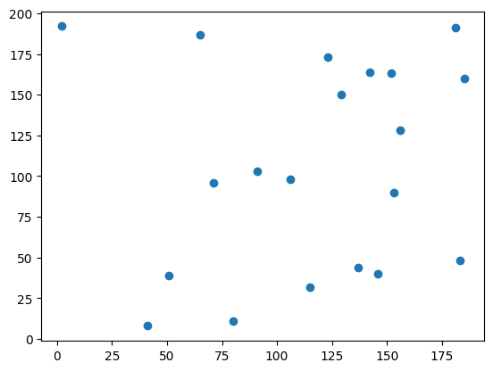
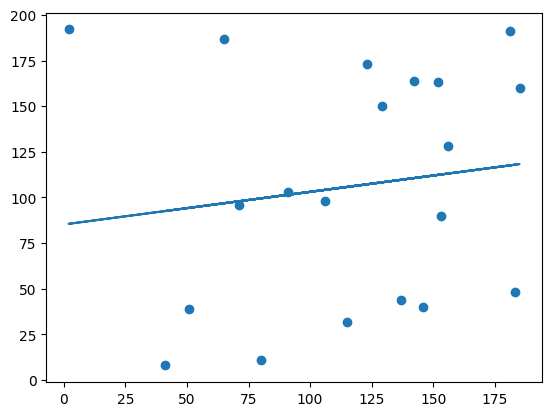
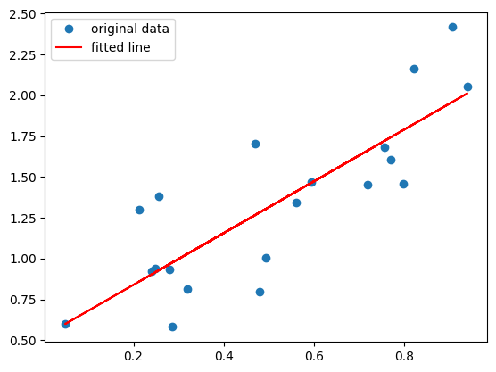
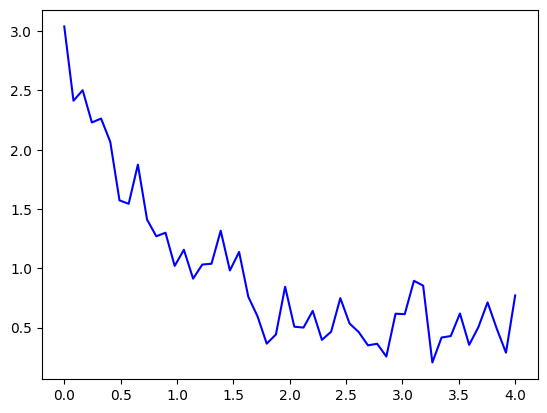
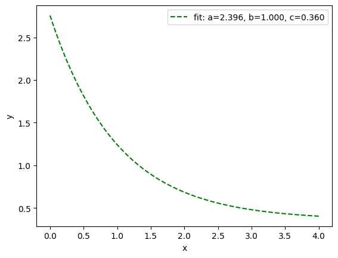
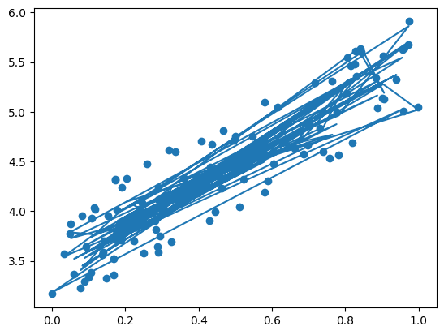

```python
# Let learn how to solve linear regression problems!
```


```python
import matplotlib.pyplot as plt
import random
from scipy import stats
import numpy as np
from scipy.optimize import curve_fit
```


```python
# Let generate some data

# Randomly make 20 numbers (for x and y respectively)
x = random.sample(range(1, 200), 20)
y = random.sample(range(1, 200), 20)

plt.scatter(x,y)
plt.show()
```


    

    


```python
# Genereate the slope
slope, intercept,r, p, std_err = stats.linregress(x, y)

# W.x+b
def Regressor(x):
    return slope * x + intercept

LinearRegression = list(map(Regressor,x))
plt.scatter(x, y)
plt.plot(x, LinearRegression)
plt.show()
```


    

    


```python
#Now, lets try and fix the problem of points above.
rng = np.random.default_rng()
x = rng.random(20)
y = 1.6*x + rng.random(20)

Residuals = stats.linregress(x, y)
plt.plot(x, y, 'o', label='original data')
plt.plot(x, Residuals.intercept + Residuals.slope*x, 'r', label='fitted line')
plt.legend()
plt.show()
```


    

    


```python
#Let's try some non-linear fitting
#The function below loosely follows a Normal/Gaussian Distribution
#Credit: https://docs.scipy.org/doc/scipy/reference/generated/scipy.optimize.curve_fit.html

def NormalFunction(x, a, b, c):
    return a * np.exp(-b * x) + c

x = np.linspace(0, 4, 50)
y = NormalFunction(x, 2.5, 1.3, 0.5)
rng = np.random.default_rng()
y_noise = 0.2 * rng.normal(size=x.size)
ydata = y + y_noise
plt.plot(x, ydata, 'b-', label='data')
```


    [<matplotlib.lines.Line2D at 0x7f109e20ec40>]


    

    


```python
popt, pcov = curve_fit(NormalFunction, x, ydata)
popt, pcov = curve_fit(NormalFunction, x, ydata, bounds=(0, [3., 1., 0.5]))
plt.plot(x, NormalFunction(x, *popt), 'g--',
         label='fit: a=%5.3f, b=%5.3f, c=%5.3f' % tuple(popt))
plt.xlabel('x')
plt.ylabel('y')
plt.legend()
plt.show()
```


    

    


```python
# Make training and testing sets
# Typically 80% of the data is for training
# and 20% is reserved for testing
# depending on the size of the dataset

# You train the model on the training set
train_x = x[:80] # Values 
train_y = y[:80] # Ground thruth/Labels

# You test the model on the test set
test_x = x[80:] # Values 
test_y = y[80:] # Ground thruth/Labels
```


```python
#Automatically generated code (Google Bard):
import matplotlib.pyplot as plt
from sklearn.linear_model import LinearRegression

# Generate some noisy data
x = np.random.rand(100, 1)
y = 2 * x + 3 + np.random.rand(100, 1)

# Create a polynomial feature transformer
from sklearn.preprocessing import PolynomialFeatures
poly = PolynomialFeatures(degree=100)

# Transform the data
X_poly = poly.fit_transform(x)

# Train a linear regression model on the transformed data
reg = LinearRegression().fit(X_poly, y)

# Plot the original data and the overfitted line
plt.scatter(x, y)
plt.plot(x, reg.predict(X_poly))
plt.show()
```


    

    


```python
# Dealing with overfitting (model is too complex)
    # -> Add more data 
    # -> Cross-validate
    # -> Feature selection
    # -> Regularization AKA simplify data (lasso, ride , elastic net)

# Dealing with underfitting for linear regression (model is too simple)
    # -> LWLR (locally weighted linear regression)
```
