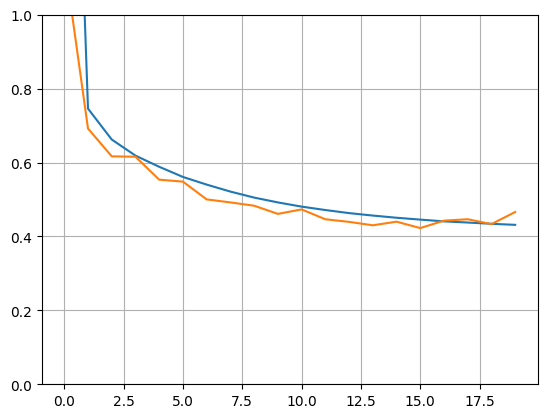

```python
import tensorflow as tf
tf.__version__
```


    '2.13.0'


```python
# creating a matrix using tensors
A = tf.constant([[1,2,3],[4,5,6]])
print(A)

# creating a scalar using tensors
B = tf.constant(42)
print(B)
```

    tf.Tensor(
    [[1 2 3]
     [4 5 6]], shape=(2, 3), dtype=int32)
    tf.Tensor(42, shape=(), dtype=int32)


```python
# Creating 3 variables (constants)
x = tf.Variable(3, name="x", dtype=tf.float32)
y = tf.Variable(2, name="y", dtype=tf.float32)
z = tf.Variable(1, name="z", dtype=tf.float32)
g = x*y*z+x*x+z

print(g.numpy())
```

    16.0


```python
# Exercise 1.1. Modify the code above to compute the value of  𝑓(𝑥,𝑦,𝑧)=𝑥3+𝑦2+𝑦𝑧+3 
# with  𝑥=−2 ,  𝑦=5  and  𝑧=1.2  Hint: you can use assign() method to modify the values 
# of tf.variable. E.g. to change the value of  𝑥 , use x.assign().

x.assign(-2)
y.assign(5)
z.assign(1.2)
f = x**3+y**2+y*z+3

print(f)
```

    tf.Tensor(26.0, shape=(), dtype=float32)


```python
# Lets implement linear regression using tensor flow

import numpy as np
from sklearn.datasets import fetch_california_housing

# load the dataset
housing = fetch_california_housing()
m, n = housing.data.shape
housing_features = np.c_[np.ones((m,1)), housing.data]
```


```python
# define the pseudo-inverse equation in tensorflow
X = tf.constant(housing_features, dtype=tf.float32, name="X")
y = tf.constant(housing.target.reshape(-1, 1), dtype=tf.float32, name="y")
Xt = tf.transpose(X)
```


```python
w = tf.matmul(tf.matmul(tf.linalg.inv(tf.matmul(Xt, X)), Xt), y)

weights = w.numpy()
print(weights)
```

    [[-3.71799126e+01]
     [ 4.35986489e-01]
     [ 9.39679705e-03]
     [-1.06469184e-01]
     [ 6.41464353e-01]
     [-4.09536187e-06]
     [-3.77989258e-03]
     [-4.23745275e-01]
     [-4.37187374e-01]]


```python
#Calcuate y_predicted
y_predicted = tf.matmul(X,w)
y_predicted
```


    <tf.Tensor: shape=(20640, 1), dtype=float32, numpy=
    array([[4.1231384 ],
           [3.968216  ],
           [3.6693993 ],
           ...,
           [0.15993881],
           [0.3078537 ],
           [0.50409317]], dtype=float32)>


```python
#Calculate error
error = y - y_predicted
error
```


    <tf.Tensor: shape=(20640, 1), dtype=float32, numpy=
    array([[ 0.4028616 ],
           [-0.3832159 ],
           [-0.14839935],
           ...,
           [ 0.76306117],
           [ 0.5391463 ],
           [ 0.38990682]], dtype=float32)>


```python
#Calculate RMSE
rmse = tf.sqrt(tf.reduce_mean(tf.square(error)))
rmse.numpy()
```


    0.7241494


```python
#Gradient descent instead of the pseudo inverse

n_steps = 10000
learn_rate = 0.01

X = tf.constant(housing_features, dtype=tf.float32, name="X")
y = tf.constant(housing.target.reshape(-1, 1), dtype=tf.float32, name="y")
w = tf.Variable(tf.random.uniform([n+1,1], -1.0, 1.0), name="w")
    
for step in range(n_steps):
    if step % 500 == 0:
        with tf.GradientTape() as tape:
            y_hat = tf.matmul(X, w, name="y_hat")
            error = y - y_hat
            mse = tf.reduce_mean(tf.square(error), name="mse")
            print("Step", step, "MSE =", mse.numpy())
            
        gradients = tape.gradient(mse, [w])
        w.assign(w - learn_rate * gradients[0])
        

    
w_best = w.numpy()
```

    Step 0 MSE = 545589.25
    Step 500 MSE = 2401392700000000.0
    Step 1000 MSE = 1.0615177e+25
    Step 1500 MSE = inf
    Step 2000 MSE = inf
    Step 2500 MSE = inf
    Step 3000 MSE = inf
    Step 3500 MSE = inf
    Step 4000 MSE = inf
    Step 4500 MSE = nan
    Step 5000 MSE = nan
    Step 5500 MSE = nan
    Step 6000 MSE = nan
    Step 6500 MSE = nan
    Step 7000 MSE = nan
    Step 7500 MSE = nan
    Step 8000 MSE = nan
    Step 8500 MSE = nan
    Step 9000 MSE = nan
    Step 9500 MSE = nan


```python
# Perform feature scaling using MinMax

from sklearn.preprocessing import MinMaxScaler

scaler = MinMaxScaler()
scaler.fit(housing_features)
scaled_housing_features = scaler.transform(housing_features)

n_steps = 10000
learn_rate = 0.01

scaled_X = tf.constant(scaled_housing_features, dtype=tf.float32, name="X")
y = tf.constant(housing.target.reshape(-1, 1), dtype=tf.float32, name="y")
w = tf.Variable(tf.random.uniform([n+1,1], -1.0, 1.0), name="w")
    
for step in range(n_steps):
    if step % 500 == 0:
        print("Step", step, "MSE =", mse.numpy())
        with tf.GradientTape() as tape:
            y_hat = tf.matmul(scaled_X, w, name="y_hat")
            error = y - y_hat
            mse = tf.reduce_mean(tf.square(error), name="mse")
    
        gradients = tape.gradient(mse, [w])
        w.assign(w - learn_rate * gradients[0])
         
w_best = w.numpy()

# The results are wayyy better!
```

    Step 0 MSE = nan
    Step 500 MSE = 3.8343768
    Step 1000 MSE = 3.7671857
    Step 1500 MSE = 3.7018652
    Step 2000 MSE = 3.6383634
    Step 2500 MSE = 3.5766287
    Step 3000 MSE = 3.5166113
    Step 3500 MSE = 3.458263
    Step 4000 MSE = 3.4015367
    Step 4500 MSE = 3.3463864
    Step 5000 MSE = 3.2927682
    Step 5500 MSE = 3.2406383
    Step 6000 MSE = 3.189955
    Step 6500 MSE = 3.1406777
    Step 7000 MSE = 3.0927665
    Step 7500 MSE = 3.046183
    Step 8000 MSE = 3.0008903
    Step 8500 MSE = 2.956851
    Step 9000 MSE = 2.9140308
    Step 9500 MSE = 2.8723943


```python
# Let make a MLP using Keras to do the same regression task

from sklearn.datasets import fetch_california_housing
from sklearn.model_selection import train_test_split
from sklearn.preprocessing import StandardScaler

# Get the dataset and split the data into training and testing
housing = fetch_california_housing()
X_train_full, X_test, y_train_full, y_test = train_test_split(housing.data, housing.target, random_state=42)
X_train, X_valid, y_train, y_valid = train_test_split(X_train_full, y_train_full, random_state=42)
```


```python
# Scale the data using standard scaler
scaler = StandardScaler()
X_train = scaler.fit_transform(X_train)
X_valid = scaler.transform(X_valid)
X_test = scaler.transform(X_test)
```


```python
# Make the actual model
np.random.seed(42)
tf.random.set_seed(42)

model = tf.keras.models.Sequential([
    tf.keras.layers.Dense(30, activation="relu", input_shape=X_train.shape[1:]),
    tf.keras.layers.Dense(1)
])
```


```python
# Run the model
model.compile(loss="mean_squared_error", optimizer=tf.keras.optimizers.SGD(learning_rate=1e-3))
history = model.fit(X_train, y_train, epochs=20, validation_data=(X_valid, y_valid))
```

    Epoch 1/20
    363/363 [==============================] - 1s 3ms/step - loss: 2.5499 - val_loss: 1.1521
    Epoch 2/20
    363/363 [==============================] - 1s 3ms/step - loss: 0.7458 - val_loss: 0.6920
    Epoch 3/20
    363/363 [==============================] - 1s 3ms/step - loss: 0.6622 - val_loss: 0.6167
    Epoch 4/20
    363/363 [==============================] - 1s 3ms/step - loss: 0.6187 - val_loss: 0.6157
    Epoch 5/20
    363/363 [==============================] - 1s 3ms/step - loss: 0.5885 - val_loss: 0.5536
    Epoch 6/20
    363/363 [==============================] - 1s 3ms/step - loss: 0.5610 - val_loss: 0.5483
    Epoch 7/20
    363/363 [==============================] - 1s 3ms/step - loss: 0.5403 - val_loss: 0.5002
    Epoch 8/20
    363/363 [==============================] - 1s 3ms/step - loss: 0.5214 - val_loss: 0.4921
    Epoch 9/20
    363/363 [==============================] - 1s 3ms/step - loss: 0.5051 - val_loss: 0.4831
    Epoch 10/20
    363/363 [==============================] - 1s 3ms/step - loss: 0.4921 - val_loss: 0.4610
    Epoch 11/20
    363/363 [==============================] - 1s 3ms/step - loss: 0.4807 - val_loss: 0.4731
    Epoch 12/20
    363/363 [==============================] - 1s 3ms/step - loss: 0.4715 - val_loss: 0.4465
    Epoch 13/20
    363/363 [==============================] - 1s 3ms/step - loss: 0.4631 - val_loss: 0.4394
    Epoch 14/20
    363/363 [==============================] - 1s 3ms/step - loss: 0.4565 - val_loss: 0.4301
    Epoch 15/20
    363/363 [==============================] - 1s 3ms/step - loss: 0.4506 - val_loss: 0.4399
    Epoch 16/20
    363/363 [==============================] - 1s 3ms/step - loss: 0.4455 - val_loss: 0.4226
    Epoch 17/20
    363/363 [==============================] - 1s 3ms/step - loss: 0.4407 - val_loss: 0.4427
    Epoch 18/20
    363/363 [==============================] - 1s 3ms/step - loss: 0.4376 - val_loss: 0.4465
    Epoch 19/20
    363/363 [==============================] - 1s 3ms/step - loss: 0.4342 - val_loss: 0.4333
    Epoch 20/20
    363/363 [==============================] - 1s 3ms/step - loss: 0.4314 - val_loss: 0.4661


```python
# Plot the data, from history of the object*?, list of epochs, loss and more

import pandas as pd
import matplotlib.pyplot as plt
plt.plot(pd.DataFrame(history.history))
plt.grid(True)
plt.gca().set_ylim(0, 1)
plt.show()
```


    

    


```python
# Calculate MSE on test set 
mse_test = model.evaluate(X_test, y_test)
```

    162/162 [==============================] - 0s 2ms/step - loss: 0.4276


```python
# Pick a data point from the test set and lets predict it using the model we made
X_new = X_test[:1]

y_pred = model.predict(X_new)
y_pred
```

    1/1 [==============================] - 0s 94ms/step


    array([[0.6025089]], dtype=float32)


```python

```
