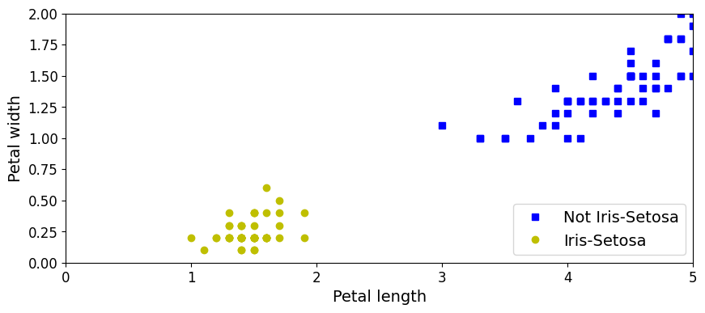
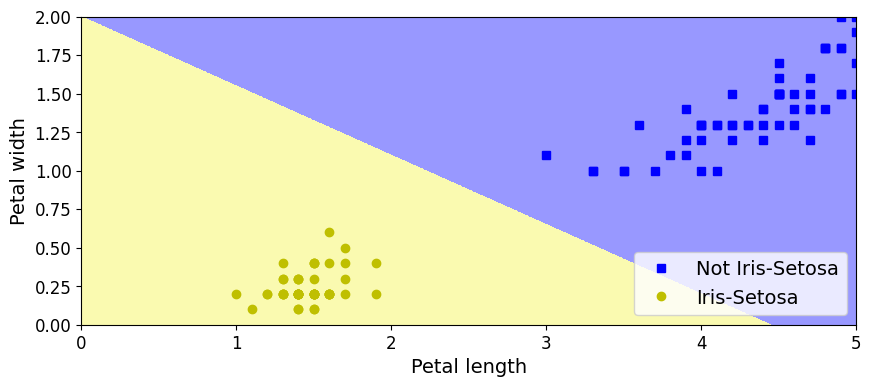
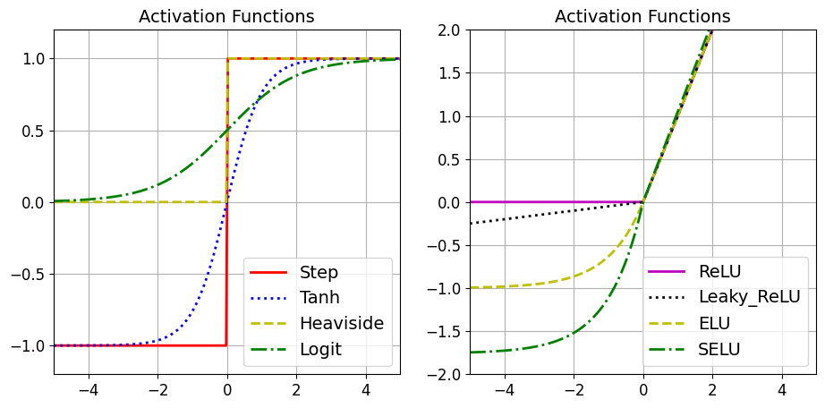

```python
#SETUP
```


```python
import os
import numpy as np
import tensorflow as tf
import matplotlib
import matplotlib.pyplot as plt

tf.__version__

# To plot nice figures
%matplotlib inline
plt.rcParams['axes.labelsize'] = 14
plt.rcParams['xtick.labelsize'] = 12
plt.rcParams['ytick.labelsize'] = 12

# Clear tensorflow's and reset seed
def reset_graph(seed=None):
    tf.reset_default_graph()
    tf.set_random_seed(seed)
    np.random.seed(seed)
```

    2023-11-16 17:43:56.316262: I tensorflow/tsl/cuda/cudart_stub.cc:28] Could not find cuda drivers on your machine, GPU will not be used.
    2023-11-16 17:43:56.710989: I tensorflow/tsl/cuda/cudart_stub.cc:28] Could not find cuda drivers on your machine, GPU will not be used.
    2023-11-16 17:43:58.407272: W tensorflow/compiler/tf2tensorrt/utils/py_utils.cc:38] TF-TRT Warning: Could not find TensorRT


```python
from sklearn.datasets import load_iris

# get dataset
iris = load_iris()
X = iris.data[:, (2, 3)]  # use only petal length and petal width
y = (iris.target == 0).astype(int) # classify them as either setosa or not setosa

# visualise the data
axes = [0, 5, 0, 2]
plt.figure(figsize=(10, 4))
plt.plot(X[y==0, 0], X[y==0, 1], "bs", label="Not Iris-Setosa")
plt.plot(X[y==1, 0], X[y==1, 1], "yo", label="Iris-Setosa")
plt.xlabel("Petal length", fontsize=14)
plt.ylabel("Petal width", fontsize=14)
plt.legend(loc="lower right", fontsize=14)
plt.axis(axes)
plt.show()
```


    

    


```python
# THE PERCEPTRON
```


```python
from sklearn.linear_model import Perceptron

# initialise and train a perceptron
pct = Perceptron(max_iter=100, random_state=None)
pct.fit(X, y)
```


<style>#sk-container-id-1 {color: black;background-color: white;}#sk-container-id-1 pre{padding: 0;}#sk-container-id-1 div.sk-toggleable {background-color: white;}#sk-container-id-1 label.sk-toggleable__label {cursor: pointer;display: block;width: 100%;margin-bottom: 0;padding: 0.3em;box-sizing: border-box;text-align: center;}#sk-container-id-1 label.sk-toggleable__label-arrow:before {content: "▸";float: left;margin-right: 0.25em;color: #696969;}#sk-container-id-1 label.sk-toggleable__label-arrow:hover:before {color: black;}#sk-container-id-1 div.sk-estimator:hover label.sk-toggleable__label-arrow:before {color: black;}#sk-container-id-1 div.sk-toggleable__content {max-height: 0;max-width: 0;overflow: hidden;text-align: left;background-color: #f0f8ff;}#sk-container-id-1 div.sk-toggleable__content pre {margin: 0.2em;color: black;border-radius: 0.25em;background-color: #f0f8ff;}#sk-container-id-1 input.sk-toggleable__control:checked~div.sk-toggleable__content {max-height: 200px;max-width: 100%;overflow: auto;}#sk-container-id-1 input.sk-toggleable__control:checked~label.sk-toggleable__label-arrow:before {content: "▾";}#sk-container-id-1 div.sk-estimator input.sk-toggleable__control:checked~label.sk-toggleable__label {background-color: #d4ebff;}#sk-container-id-1 div.sk-label input.sk-toggleable__control:checked~label.sk-toggleable__label {background-color: #d4ebff;}#sk-container-id-1 input.sk-hidden--visually {border: 0;clip: rect(1px 1px 1px 1px);clip: rect(1px, 1px, 1px, 1px);height: 1px;margin: -1px;overflow: hidden;padding: 0;position: absolute;width: 1px;}#sk-container-id-1 div.sk-estimator {font-family: monospace;background-color: #f0f8ff;border: 1px dotted black;border-radius: 0.25em;box-sizing: border-box;margin-bottom: 0.5em;}#sk-container-id-1 div.sk-estimator:hover {background-color: #d4ebff;}#sk-container-id-1 div.sk-parallel-item::after {content: "";width: 100%;border-bottom: 1px solid gray;flex-grow: 1;}#sk-container-id-1 div.sk-label:hover label.sk-toggleable__label {background-color: #d4ebff;}#sk-container-id-1 div.sk-serial::before {content: "";position: absolute;border-left: 1px solid gray;box-sizing: border-box;top: 0;bottom: 0;left: 50%;z-index: 0;}#sk-container-id-1 div.sk-serial {display: flex;flex-direction: column;align-items: center;background-color: white;padding-right: 0.2em;padding-left: 0.2em;position: relative;}#sk-container-id-1 div.sk-item {position: relative;z-index: 1;}#sk-container-id-1 div.sk-parallel {display: flex;align-items: stretch;justify-content: center;background-color: white;position: relative;}#sk-container-id-1 div.sk-item::before, #sk-container-id-1 div.sk-parallel-item::before {content: "";position: absolute;border-left: 1px solid gray;box-sizing: border-box;top: 0;bottom: 0;left: 50%;z-index: -1;}#sk-container-id-1 div.sk-parallel-item {display: flex;flex-direction: column;z-index: 1;position: relative;background-color: white;}#sk-container-id-1 div.sk-parallel-item:first-child::after {align-self: flex-end;width: 50%;}#sk-container-id-1 div.sk-parallel-item:last-child::after {align-self: flex-start;width: 50%;}#sk-container-id-1 div.sk-parallel-item:only-child::after {width: 0;}#sk-container-id-1 div.sk-dashed-wrapped {border: 1px dashed gray;margin: 0 0.4em 0.5em 0.4em;box-sizing: border-box;padding-bottom: 0.4em;background-color: white;}#sk-container-id-1 div.sk-label label {font-family: monospace;font-weight: bold;display: inline-block;line-height: 1.2em;}#sk-container-id-1 div.sk-label-container {text-align: center;}#sk-container-id-1 div.sk-container {/* jupyter's `normalize.less` sets `[hidden] { display: none; }` but bootstrap.min.css set `[hidden] { display: none !important; }` so we also need the `!important` here to be able to override the default hidden behavior on the sphinx rendered scikit-learn.org. See: https://github.com/scikit-learn/scikit-learn/issues/21755 */display: inline-block !important;position: relative;}#sk-container-id-1 div.sk-text-repr-fallback {display: none;}</style><div id="sk-container-id-1" class="sk-top-container"><div class="sk-text-repr-fallback"><pre>Perceptron(max_iter=100, random_state=None)</pre><b>In a Jupyter environment, please rerun this cell to show the HTML representation or trust the notebook. <br />On GitHub, the HTML representation is unable to render, please try loading this page with nbviewer.org.</b></div><div class="sk-container" hidden><div class="sk-item"><div class="sk-estimator sk-toggleable"><input class="sk-toggleable__control sk-hidden--visually" id="sk-estimator-id-1" type="checkbox" checked><label for="sk-estimator-id-1" class="sk-toggleable__label sk-toggleable__label-arrow">Perceptron</label><div class="sk-toggleable__content"><pre>Perceptron(max_iter=100, random_state=None)</pre></div></div></div></div></div>


```python
# Extract the decision bondary

x0, x1 = np.meshgrid(
        np.linspace(axes[0], axes[1], 1000).reshape(-1, 1),
        np.linspace(axes[2], axes[3], 1000).reshape(-1, 1),)

X_new = np.c_[x0.ravel(), x1.ravel()]
y_predict = pct.predict(X_new)
zz = y_predict.reshape(x0.shape)

# plot the datapoints again
plt.figure(figsize=(10, 4))
plt.plot(X[y==0, 0], X[y==0, 1], "bs", label="Not Iris-Setosa")
plt.plot(X[y==1, 0], X[y==1, 1], "yo", label="Iris-Setosa")

# get a nice color
from matplotlib.colors import ListedColormap
custom_cmap = ListedColormap(['#9898ff', '#fafab0'])

# plot the predicted samples of feature space
plt.contourf(x0, x1, zz, cmap=custom_cmap)
plt.xlabel("Petal length", fontsize=14)
plt.ylabel("Petal width", fontsize=14)
plt.legend(loc="lower right", fontsize=14)
plt.axis(axes)
plt.show()
```


    

    


```python
def heaviside(z): 
    return (z >= 0).astype(z.dtype)

def logit(z):
    return 1 / (1 + np.exp(-z))

def relu(z):
    return np.maximum(0, z)

def leaky_relu(z, alpha=0.01):
    return np.where(z > 0, z, alpha * z)

def elu(z, alpha=1):
    return np.where(z < 0, alpha * (np.exp(z) - 1), z)

def selu(z,
         scale=1.0507009873554804934193349852946,
         alpha=1.6732632423543772848170429916717):
    return scale * elu(z, alpha)
```


```python
# Plot the different activatin functions
z = np.linspace(-5, 5, 200)

plt.figure(figsize=(11,11))

plt.subplot(221)
plt.plot(z, np.sign(z), "r-", linewidth=2, label="Step")
plt.plot(z, np.tanh(z), "b:", linewidth=2, label="Tanh")
plt.plot(z, heaviside(z), "y--", linewidth=2, label="Heaviside")
plt.plot(z, logit(z), "g-.", linewidth=2, label="Logit")
plt.grid(True)
plt.legend(loc="lower right", fontsize=14)
plt.title("Activation Functions", fontsize=14)
plt.axis([-5, 5, -1.2, 1.2])

plt.subplot(222)
plt.plot(z, relu(z), "m-", linewidth=2, label="ReLU")
plt.plot(z, leaky_relu(z, 0.05), "k:", linewidth=2, label="Leaky_ReLU")
plt.plot(z, elu(z), "y--", linewidth=2, label="ELU")
plt.plot(z, selu(z), "g-.", linewidth=2, label="SELU")
plt.grid(True)
plt.legend(loc="lower right", fontsize=14)
plt.title("Activation Functions", fontsize=14)
plt.axis([-5, 5, -2, 2])

plt.show()
```


    

    


```python
# (Deeper) Neural Net for MNIST on TensorFlow
```


```python
# Load MNIST
(X_train_full, y_train_full), (X_test, y_test) = tf.keras.datasets.mnist.load_data()

#We will also create validation set. Further, we #scale the pixel intensities down to the 0-1 range and convert them to floats, by dividing by 255.
X_valid, X_train = X_train_full[:5000] / 255., X_train_full[5000:] / 255.
y_valid, y_train = y_train_full[:5000], y_train_full[5000:]
X_test = X_test / 255.
```

    Downloading data from https://storage.googleapis.com/tensorflow/tf-keras-datasets/mnist.npz
    11490434/11490434 [==============================] - 2s 0us/step


```python
plt.imshow(X_train[0], cmap="binary")
plt.axis('off')
plt.show()
```


    

    


```python
#Designing model with two hidden layers and an output layer
model = tf.keras.models.Sequential()
model.add(tf.keras.layers.Flatten(input_shape=[28,28]))
model.add(tf.keras.layers.Dense(200,activation="relu"))
model.add(tf.keras.layers.Dense(100,activation="relu"))
model.add(tf.keras.layers.Dense(10,activation="softmax"))

```


```python
model.compile(loss="categorical_sparse_entropy",
              optimizer="sgd",
              metrics=["accuracy"])
```


```python
# Now we train the model
history = model.fit(X_train, y_train, epochs=30, validation_data=(X_valid, y_valid))
```

    Epoch 1/30


    2023-11-16 18:33:55.571116: W tensorflow/tsl/framework/cpu_allocator_impl.cc:83] Allocation of 172480000 exceeds 10% of free system memory.


    1719/1719 [==============================] - 9s 5ms/step - loss: 27.3036 - accuracy: 0.0921 - val_loss: 27.3191 - val_accuracy: 0.1046
    Epoch 2/30
    1719/1719 [==============================] - 8s 5ms/step - loss: 27.3034 - accuracy: 0.1003 - val_loss: 27.3191 - val_accuracy: 0.1032
    Epoch 3/30
    1719/1719 [==============================] - 8s 5ms/step - loss: 27.3034 - accuracy: 0.1009 - val_loss: 27.3191 - val_accuracy: 0.1032
    Epoch 4/30
    1719/1719 [==============================] - 8s 5ms/step - loss: 27.3034 - accuracy: 0.0998 - val_loss: 27.3190 - val_accuracy: 0.1058
    Epoch 5/30
    1719/1719 [==============================] - 8s 5ms/step - loss: 27.3034 - accuracy: 0.1000 - val_loss: 27.3190 - val_accuracy: 0.1054
    Epoch 6/30
    1719/1719 [==============================] - 8s 5ms/step - loss: 27.3034 - accuracy: 0.1002 - val_loss: 27.3190 - val_accuracy: 0.1040
    Epoch 7/30
    1719/1719 [==============================] - 8s 5ms/step - loss: 27.3033 - accuracy: 0.1003 - val_loss: 27.3190 - val_accuracy: 0.1036
    Epoch 8/30
    1719/1719 [==============================] - 8s 5ms/step - loss: 27.3033 - accuracy: 0.1004 - val_loss: 27.3190 - val_accuracy: 0.1038
    Epoch 9/30
    1719/1719 [==============================] - 8s 5ms/step - loss: 27.3034 - accuracy: 0.1006 - val_loss: 27.3190 - val_accuracy: 0.1042
    Epoch 10/30
    1719/1719 [==============================] - 8s 5ms/step - loss: 27.3033 - accuracy: 0.1013 - val_loss: 27.3190 - val_accuracy: 0.1060
    Epoch 11/30
    1719/1719 [==============================] - 8s 5ms/step - loss: 27.3033 - accuracy: 0.1012 - val_loss: 27.3190 - val_accuracy: 0.1050
    Epoch 12/30
    1719/1719 [==============================] - 8s 5ms/step - loss: 27.3033 - accuracy: 0.1013 - val_loss: 27.3190 - val_accuracy: 0.1040
    Epoch 13/30
    1719/1719 [==============================] - 8s 5ms/step - loss: 27.3033 - accuracy: 0.1015 - val_loss: 27.3190 - val_accuracy: 0.1024
    Epoch 14/30
    1719/1719 [==============================] - 8s 5ms/step - loss: 27.3033 - accuracy: 0.1019 - val_loss: 27.3190 - val_accuracy: 0.1032
    Epoch 15/30
    1719/1719 [==============================] - 8s 5ms/step - loss: 27.3033 - accuracy: 0.1023 - val_loss: 27.3190 - val_accuracy: 0.1040
    Epoch 16/30
    1719/1719 [==============================] - 9s 5ms/step - loss: 27.3033 - accuracy: 0.1022 - val_loss: 27.3190 - val_accuracy: 0.1032
    Epoch 17/30
    1719/1719 [==============================] - 9s 5ms/step - loss: 27.3033 - accuracy: 0.1023 - val_loss: 27.3190 - val_accuracy: 0.1038
    Epoch 18/30
    1719/1719 [==============================] - 9s 5ms/step - loss: 27.3033 - accuracy: 0.1026 - val_loss: 27.3189 - val_accuracy: 0.1032
    Epoch 19/30
    1719/1719 [==============================] - 9s 5ms/step - loss: 27.3033 - accuracy: 0.1027 - val_loss: 27.3189 - val_accuracy: 0.1044
    Epoch 20/30
    1719/1719 [==============================] - 9s 5ms/step - loss: 27.3033 - accuracy: 0.1031 - val_loss: 27.3189 - val_accuracy: 0.1046
    Epoch 21/30
    1719/1719 [==============================] - 9s 5ms/step - loss: 27.3033 - accuracy: 0.1030 - val_loss: 27.3189 - val_accuracy: 0.1036
    Epoch 22/30
    1719/1719 [==============================] - 9s 5ms/step - loss: 27.3033 - accuracy: 0.1038 - val_loss: 27.3189 - val_accuracy: 0.1034
    Epoch 23/30
    1719/1719 [==============================] - 9s 5ms/step - loss: 27.3033 - accuracy: 0.1039 - val_loss: 27.3189 - val_accuracy: 0.1042
    Epoch 24/30
    1719/1719 [==============================] - 9s 5ms/step - loss: 27.3033 - accuracy: 0.1039 - val_loss: 27.3189 - val_accuracy: 0.1040
    Epoch 25/30
    1719/1719 [==============================] - 9s 5ms/step - loss: 27.3033 - accuracy: 0.1040 - val_loss: 27.3189 - val_accuracy: 0.1040
    Epoch 26/30
    1719/1719 [==============================] - 9s 5ms/step - loss: 27.3034 - accuracy: 0.1043 - val_loss: 27.3189 - val_accuracy: 0.1052
    Epoch 27/30
    1719/1719 [==============================] - 9s 5ms/step - loss: 27.3034 - accuracy: 0.1043 - val_loss: 27.3189 - val_accuracy: 0.1050
    Epoch 28/30
    1719/1719 [==============================] - 9s 5ms/step - loss: 27.3034 - accuracy: 0.1045 - val_loss: 27.3189 - val_accuracy: 0.1056
    Epoch 29/30
    1719/1719 [==============================] - 9s 5ms/step - loss: 27.3033 - accuracy: 0.1048 - val_loss: 27.3189 - val_accuracy: 0.1058
    Epoch 30/30
    1719/1719 [==============================] - 9s 5ms/step - loss: 27.3034 - accuracy: 0.1051 - val_loss: 27.3189 - val_accuracy: 0.1064


```python

```
